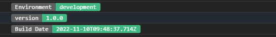

## 简介

控制台打印webpack打包信息的webpack插件

插件使用效果


## 使用

webpack.config.js
```js
const BuildTagWebpackPlugin = require('build-tag-webpack-plugin')
module.exports = {
  entry: 'index.js',
  output: {
    path: __dirname + '/dist',
    filename: 'index_bundle.js'
  },
  plugins: [
    new BuildTagWebpackPlugin({
      // version: '1.0.0', // 打印版本可选，不填自动读取package.json的版本
      // banner: string | Function, // 插入入口文件的信息
    })
  ]
}
```
